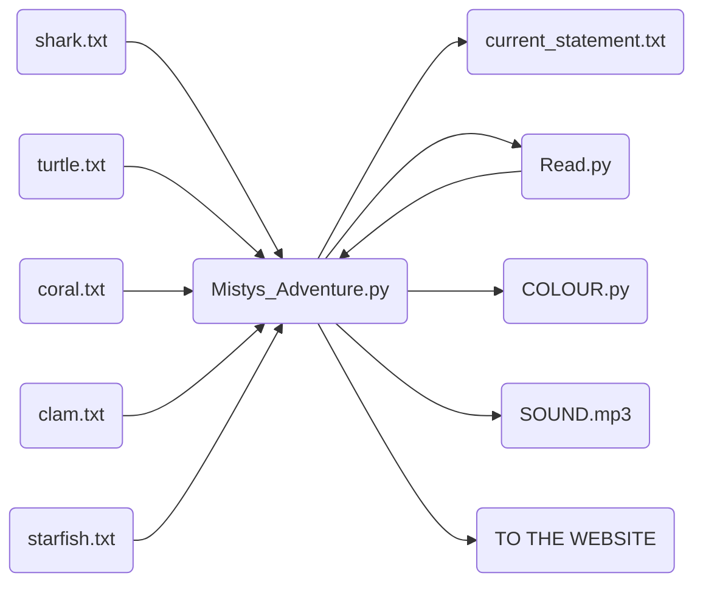

# Misty's Adventure
Welcome to **Misty's Adventure**. The game where you can fish for how you feel! Here you can find all of the components and functions for the game!

# Technical Components
 
 - Raspberry Pi with an internet connection
 - RFID scanner and RFID Tags
 - LED strips
 - Screen or tablet that can connect to the internet
 - Speakers


# Misty's Adventure - Back End
 This section will cover all of the functions to get the back end of the application all in working order!

# Files

The back-end of the application has 9 python program files:

   ``` Mistys_Adventure.py ```
   
   ```Read.py```

  ```Write.py```

```blue.py```

```red.py```

```purple.py```

```pink.py```

```green.py```

```orange.py```

    


## How it works

``` Mistys_Adventure.py ```
This is the main program file from which the game runs. It utilises all the other files included in the folder and will call several python scripts.

```Read.py```
This script is used in the main program to read the RFID tags.

 ```Write.py```
This script is used to write the RFID tags.

```COLOUR.py```
These scripts are responsible for changing the colour of the LED strip based on which sea creature has been scanned.


## Running the application
As a prerequisite, it is recommended that you include the questions you want each sea creature to ask in their text files and appropriate folder "input". Make sure to add statements on each line separately. For example, if you want to add questions to the shark, open input/shark.txt, then simply write your statements separated by a new line.

Also, make sure to include the necessary folders such as TTS and input, this is so the file paths line up with the program code.

Install nodemon 
  ```bash 
  npm i -g nodemon
  ```

To run the application, either open the Mistys_Adventure.py file then run it through your preferred IDE, or use the terminal to navigate to the folder it is located in and type the following:

  ```bash
nodemon server.mjs
```
    
Now simply pick up your fishing rod and play the game!


## UML diagrams

Here is a UML diagram of the back-end of the application detailing how the different modules interact with each other and their relationships.





# Misty's Adventure - Front End

This section will cover all of the functions to get the front end of the application all in working order!


# Files

The front-end of the application has 3 main files:

``` index.html ```

```Controller.js```

```style.css``` 

## How it works

``` index.html ```
is where all the front end items are being rendered. They are split into groups of various headings to keep things organised. The main bodies of text are kept within article tags to easily group content. Each article is given a tag from one to six. This is so we can use
```Controller.js```
to animate the properties. This is done by collating the height of the page and assigning a region a certain colour. Then when passing into a new region indicated by the tag of the article changing, using the tween parameter to transition between the colors.
```style.css``` 
allows for correct text formatting by adding padding and margin width so that when our device is in a different orientation, the text still remains clear and unobstructed.
```server.mjs``` 
This contains two elements the server which is ran on localhost using port 3000, in addition to this a websocket it also running on port 3001, this allows client-host communication so that behaviour that is exhibited on the host machine it is mirrored on the client. 

# Running the application

As a prerequisite it is reccomended that you are running the latest version of Node
> Before attempting to run the application install [Node](https://nodejs.org/en) here 
> Before attempting to run the web server install [Express](https://expressjs.com/en/starter/installing.html) here 

To install node run the command 

```bash
npm install node
```

To install express run the command 

```bash
npm install express
```
This will install all the dependencies for you and allow you to run the server. From then, open a new terminal and run the following command...
```bash
node server.mjs
```
This will run the server, happy days!

## Connecting to the webpage

To connect to the webpage it's as easy as 1.2.3... once you have the server running, you then have to make sure you are on the same WIFI network as the Raspberry Pi then click this link to take to you to the local host.

[Website](http://localhost:3000) | *This will take you to localhost*

## Resources Used

```server.mjs```
was coded using resources from the Web-03 practical material. The websocket was coded using code from [Digital Interaction - Context aware applications](https://digitalinteraction.github.io/technologies/iot-06-context.html) with the help and support from Dan Jackson. Further material from [Capture External Process](https://digitalinteraction.github.io/technologies/sample-external-process.html) was used to capture incoming data streams from
```mistysadventure.py```


## UML diagram

Here is a UML diagram of the front-end of the application detailing how the different modules interact with each other and thier relationships...

```mermaid
graph LR
F(Mistys_Adventure.py) --> D
A(Controller.js) --> D
B(Style.css) --> D
C(index.html) --> D(Server.mjs + Websocket)
D --> F
D --> E(http://localhost:3000)
