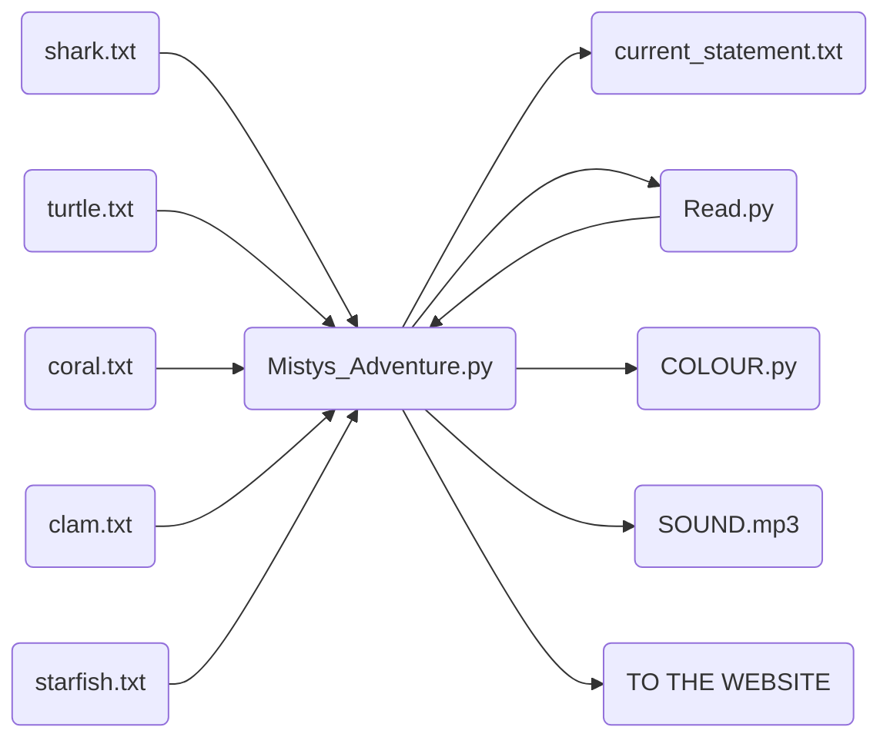

## UML diagrams

Here is a UML diagram of the back-end of the application detailing how the different modules interact with each other and their relationships.





Here is a UML diagram of the front-end of the application detailing how the different modules interact with each other and thier relationships...

```mermaid
graph LR
F(Mistys_Adventure.py) --> D
A(Controller.js) --> D
B(Style.css) --> D
C(index.html) --> D(Server.mjs + Websocket)
D --> F
D --> E(http://localhost:3000)
